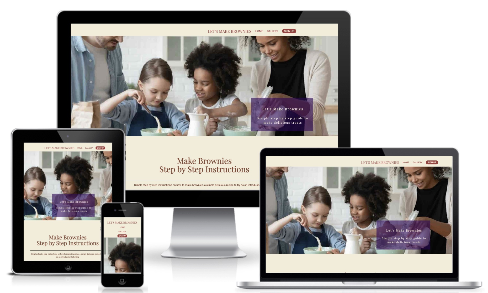
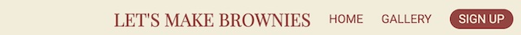
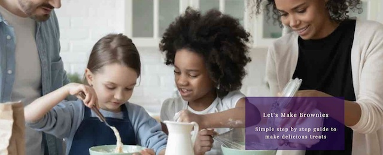
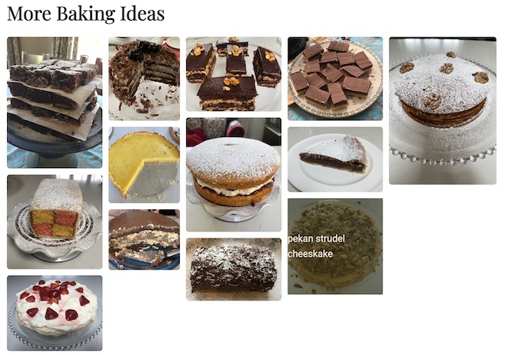
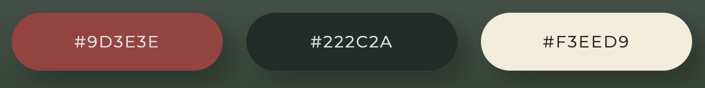
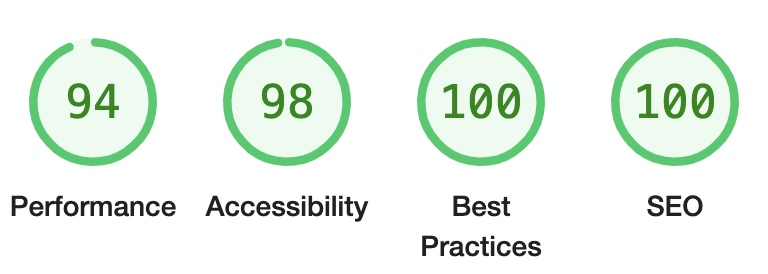

# Let’s Make Brownies

The website is a personal portfolio project one assignment for the Code Institute’s Full Stack Developer course. It's purpose is to demonstrate student's aptitude for working in html and css with user centre design in place. 
The website presents a simple step by step method for beginner baking enthusiasts to follow in their journey in learning how to bake. 

The live website can be found [HERE](https://dooco.github.io/brownies/)

# User Experience 

## User stories 

1. As someone new to baking, I want to find clear simple steps about how to make brownies. It needs to be descriptive with images of what to be achieved at each stage of the process.
2. As a returning visitor with some baking experience I want to have access to trusted method and ingredients list which will make it easy to navigate to the information I need to complete the baking project.
3. As a regular visitor I want to be included in the newsletter for further updates on new baking recipes.

# Structure

## Header and Navigation
The header provides a holder for the site logo and navigation elements of the site. The navigation bar is found on the top of all pages for easy navigation to the different pages of the site. By being identical and in the same location on all pages it  makes it easy for the user to navigate through the various pages of the website. 

## Hero image
The hero image on the home page sets the atmosphere that the site is aiming to deliver, family engaged in the process of baking. 

## Sections
An introduction section is followed by seven sections each section representing a significant step in the brownie making process. Accompanying an image of each step is a list or a description of the particular step. Each section heading has a Font Awesome icon depicting elements of the process.
Sections alternate with image first and descriptive text next and then with descriptive text and image. The colours used in alternate sections create a contrast as the home page is scrolled. 
 
 
 
## Footer
The footer section provides links to the social media sites of Let’s Make Brownies and is located at the bottom on each page making it easy for user to find and the links open in a new tab providing easy navigation for the user.

## Gallery page
Pictures of various baking projects

## Sign up page

## Form for user to enter name and email address to request further information on baking projects.

# Design

## Imagery
The learning process is enhances where imagery is used to describe the various stages in a process and this is utilised in Let’s Make Brownies by introducing photos of the ingredients and the photos of the various stages in the brownie making process.
  
Photos of the different baking projects are presented in the gallery page to encourage interested bakers to develop their skills by trying more advanced baking projects.

# Typography
Two fonts are used throughout the site : Roboto, used for body of site and ‘Playfair Display’, used for headings one and two. 

# Colour Scheme
Three main colours are used throughout the site:

# Wireframes

# Home page 

# Gallery page

# Sign up page

# Technologies used

# Languages
- HTML5
    - HTML5 was used as the main language to complete the structure of the Website.
- CSS
    - Custom written CSS is used to style the website and define the responsive elements of the site.

# Tools
- Visual Studio Code
    - VSCode was used as the preferred IDE.
- Git
    - Git was used for version control to commit to Git.
- Github
    - GithHub repository is used store and manage code, as well as track and control changes to code on a cloud-based service. Git Pages is used for the deployment of the live site.
- Font Awesome
    - Font awesome icons are used to add style to the headings of each of the sections on the home page and for the social media links contained in the footer section of the website.
- Am I Responsive?
    - Am I Responsive was used to generate mockup responsive imagery on various devices.

# Libraries
- Google Fonts 
    - "Roboto" and "Playfair Display" google fonts is used to import the fonts into the style.css file. These fonts were used throughout the project.

# Limitations 
- Due to the site being a static site (html & css), there are limitations to the scope of the website and its function can only be a descriptive site. Further investigaion, with expanded technologies, could expand the function of the website with more interaction with the user. 

# Testing
A process of continuous testing was carried out throughout the development of the website with display or functionality improvements made as they were warranted. Testing consisted of observing the site’s visible responses to different view screens and on different browsers.
The site was viewed and tested on the Google Chrome, Firefox, Microsoft Edge, Internet Explorer and Safari browsers.

Google Chrome Developer tools and Firefox Developer edition were used to test site’s response to various screen sizes. Care was taken, during testing, to avoid overlapping of elements, loss of information due to scrolling off page and ensuring alignment of elements. 
Media queries are incorporated to ensure the site displays properly at break points between different device screen sizes. Over-lapping issues were detected on the navigation area when viewed on smaller screen size. The issue was resolved by introducing flex display in the navigation.

Internal links were tested to ensure that they navigated to the appropriate position on the site. External links were tested to ensure that a new page was opened whenever an external link was selected and that it was directed correctly.

# Validator Test
All Pages were run through the W3C HTML Validator and showed no errors.
CSS Stylesheet was run through the W3C CSS Validator and showed no errors.

# Lighthouse 

# Resolutions to issues found during testing

- Spelling mistakes and ommissions were found when proof reading, were then corrected.
- Hero image zoomed in so that only a portion of the image could be seen. Issue resolved by sizing the image and saving the re-sized image.
- Navigation menu items were being overlapped on smaller screens. Resolved by adding a media query for small screens that changes display from row to column.
- Content was stretched across the entire width of the screen. Resolved by introducing container that had max width of 1100 px.
- 
# Credits

# References
